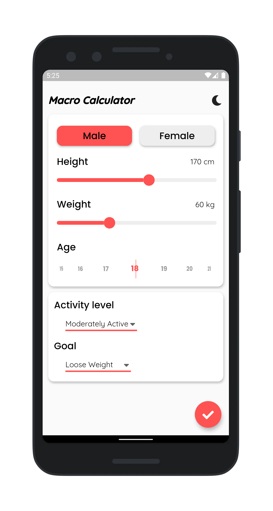
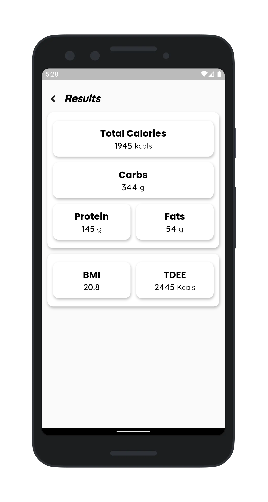
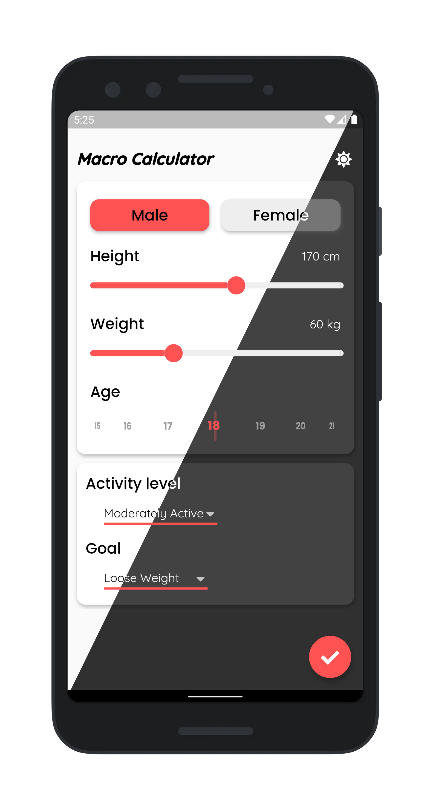

# Macro Calculator
Macro calcualtor is a simple app that calculates the required macros and calculator based on height, weight, age and activity level.

## Screenshots

   

----
## License
[MIT](https://choosealicense.com/licenses/mit/)
